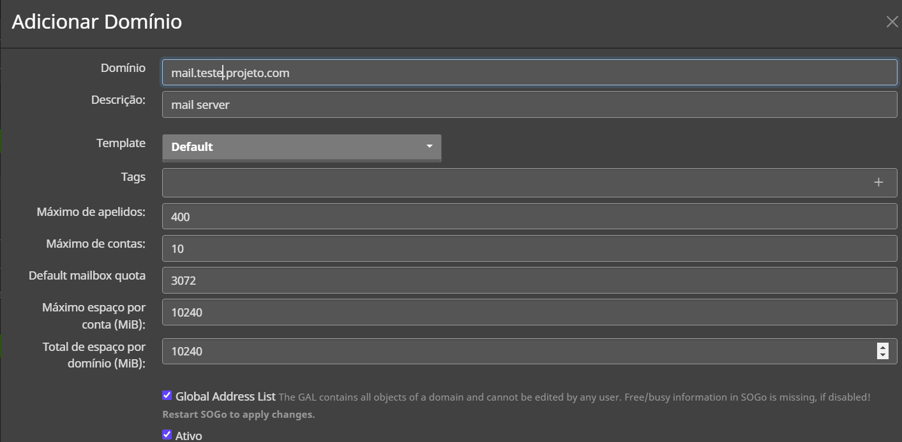
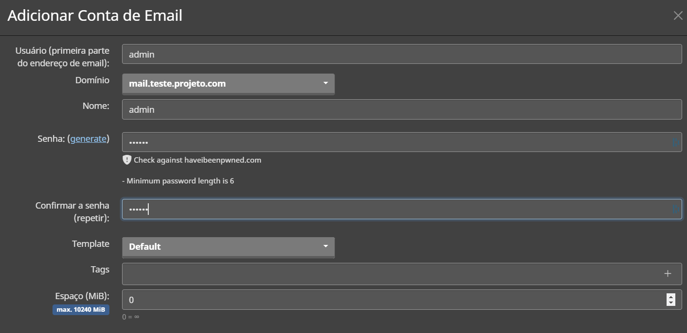

# Mailcow Configuration

## Add a Domain

1. In the <mark style="color:red;">`https://your_ip_address/mailbox`</mark> you can add your <mark style="color:red;">**mail server domain**</mark>.

<figure><figcaption>
Fig 1. Add a Domain in the Mailcow
</figcaption></figure>

1. Then scroll down and click in the <mark style="color:red;">**Add domain and restart SOGo**</mark>.

### Add a Mailbox

1. In the tab <mark style="color:red;">**Mailboxes**</mark> in the <mark style="color:red;">`https://your_ip_address/mailbox`</mark> you can create mailboxes for users.

<figure><figcaption>
Fig 1. Add a Mailbox
</figcaption></figure>

2. Then scroll down and save the configuration.
