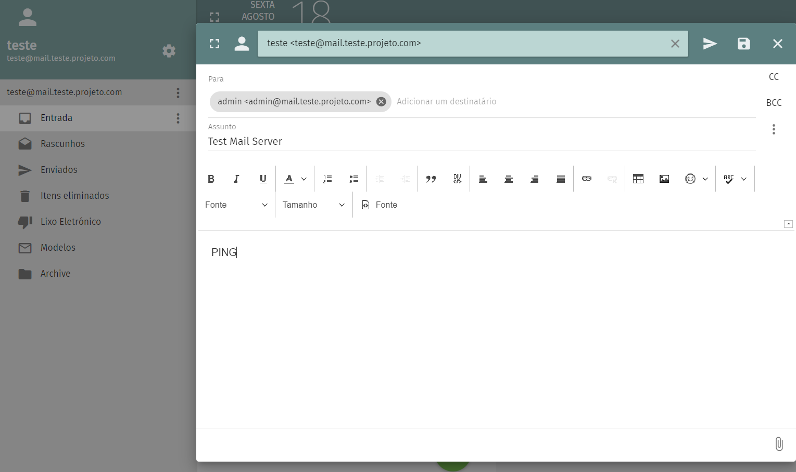
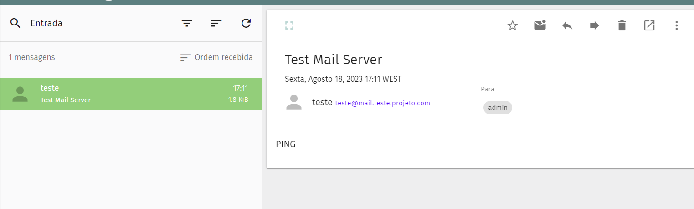
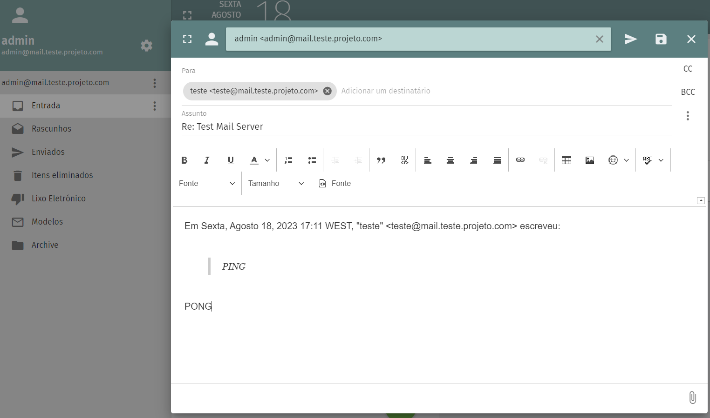
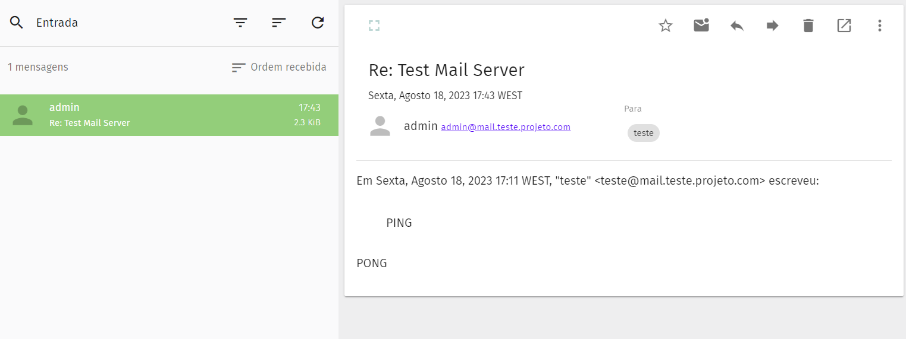

# Test the Mail Server

## Send an Email

1. To test the <mark style="color:red;">**Mail Server**</mark> and the <mark style="color:red;">**DNS MX record**</mark>, it was created two users (<mark style="color:red;">**teste**</mark> and <mark style="color:red;">**admin**</mark>).
2. Login into the <mark style="color:red;">**mailbox/user**</mark> created earlier with the <mark style="color:red;">**user@domain**</mark> and the <mark style="color:red;">**password**</mark>.
3. Send an email to the other user created.

<figure><figcaption>
Fig 3. Email sending
</figcaption></figure>

4. Next login into the other <mark style="color:red;">**mailbox/user**</mark> created to view the email recived and respond to the email.

<figure><figcaption>
Fig 4. Reading the email
</figcaption></figure>

 

<figure><figcaption>
Fig 5. Email sending
</figcaption></figure>

5. To finish, login into the count used in point 2 and check the email was delivered.

<figure><figcaption>
Fig 6. Reading the email
</figcaption></figure>
